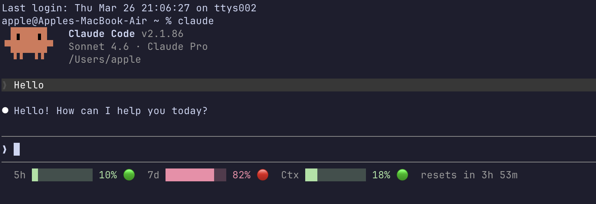

# claude-rate-limit

Real-time rate limit status bar for Claude Code. Displays your 5-hour usage, 7-day usage, context window fill, and reset countdown — live in the native bottom status bar, updating automatically after every response.



## Install

```bash
npx claude-rate-limit
```

Restart Claude Code. The status bar appears immediately at the bottom of every session.

---

## What it shows

```
5h ████░░░░░░ 38% 🟠  7d ██░░░░░░░░ 14% 🟢  Ctx ██████░░░░ 68% 🟠  resets in 2h 14m
```

| Field | Description |
|---|---|
| `5h` | 5-hour rolling rate limit — how much of your hourly quota is used |
| `7d` | 7-day rolling rate limit — weekly usage across all sessions |
| `Ctx` | Context window fill — how full the current conversation is |
| `resets in` | Live countdown to the next 5-hour window reset |

**Color coding:**

| Usage | Color | Meaning |
|---|---|---|
| < 30% | 🟢 Green | Plenty of headroom |
| 31–75% | 🟠 Orange | Getting used |
| > 75% | 🔴 Red | Running low |

**Before the first response** (or on non-Pro plans), rate limit data isn't available yet:
```
5h --  7d --  Ctx ██░░░░░░░░ 20% 🟢  (waiting...)
```

---

## Auto-updates

The status bar refreshes **automatically after every Claude response** — no polling, no background processes, no manual refresh needed. Claude Code calls the script each turn and displays whatever it outputs. The reset countdown ticks down in real time based on the window's expiry timestamp.

---

## Notifications

Fires a macOS desktop notification + terminal bell **once per rate-limit window** (not once per day). A new window clears the fired list so notifications repeat on the next cycle.

| Threshold | Notification |
|---|---|
| 5h hits 75% | `⚠️ Claude — 5h Rate 75%` — Resets in Xh Ym |
| 5h hits 90% | `🔴 Claude — 5h Rate 90%` — Running very low |
| 5h hits 100% | `🚫 Claude — Rate Limited` — 5h limit hit |
| 7d hits 75% | `⚠️ Claude — Weekly Rate 75%` — 7-day window at 75% |

---

## Requirements

- **Node.js 18+**
- **Claude Code** with a **Pro or Max** subscription — rate limit data is only injected for paid plans
- **macOS** for desktop notifications (the status bar works on any OS)

---

## How it works

Claude Code injects rate limit percentages and reset timestamps as JSON via stdin to any script registered under `statusLine` in `~/.claude/settings.json`. This package installs `statusline.mjs` to `~/.claude/rate-limit-statusline/` and registers it — zero API calls, zero token counting, zero external dependencies.

---

## Uninstall

Remove the `statusLine` key from `~/.claude/settings.json` and delete `~/.claude/rate-limit-statusline/`.
